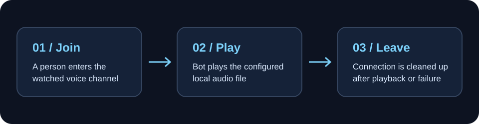

<p align="center">🔊</p>
<h1 align="center">Maneeshbot</h1>
<p align="center"><strong>A tiny Discord voice bot for a single, well-timed sound cue.</strong></p>
<p align="center">When a person enters one configured voice channel, the bot joins, plays a local audio file, and disconnects.</p>
<p align="center">
  <a href="#quick-start">Quick start</a> · <a href="#how-it-behaves">Behavior</a> · <a href="#configuration">Configuration</a> · <a href="#how-it-works">How it works</a>
</p>
<p align="center">
  
  
  
</p>



## Why this project

This is a focused event-driven bot: it listens for Discord voice-state changes, decides whether a *person just entered* the watched channel, and manages the voice connection from join through cleanup. It is a small example of integrating an external event stream with audio playback and failure handling.

## Quick start

1. Create a Discord application and bot, add it to a server, and allow it to **View Channel**, **Connect**, and **Speak** in the target voice channel.
2. Clone the repository and install the locked dependencies:

   ```bash
   git clone https://github.com/ctadros1/Maneeshbot.git
   cd Maneeshbot
   npm ci
   ```

3. Copy `.env.example` to `.env`. Set your bot token, server ID, and voice-channel ID. The template already points `AUDIO_FILE_PATH` at the bundled `assets/shabang.flac`; change it if you want to use your own audio.
4. Run `npm start`. Use `npm run dev` for automatic restart during local development.

Keep `.env` private; the bot token grants access to your Discord application.

## How it behaves

| Voice-state change | Result |
| --- | --- |
| A person joins the watched channel from no channel | Plays the sound |
| A person moves into it from another channel | Plays the sound |
| Someone leaves, changes mute/video/stream state, or joins another channel | Does nothing |
| A bot joins | Does nothing |
| Another person joins during playback | Ignores the new trigger |

There is no cooldown once playback finishes. A new valid join can trigger the sound immediately. Playback has a 60-second safety timeout, and the bot destroys the voice connection during cleanup if joining or playback fails.

## Configuration

| Variable | Purpose |
| --- | --- |
| `DISCORD_TOKEN` | Bot token from the Discord developer portal |
| `GUILD_ID` | Server to monitor |
| `TARGET_VOICE_CHANNEL_ID` | Channel to watch and join |
| `AUDIO_FILE_PATH` | Local audio path, relative to the directory where you run the bot or absolute |

The code defaults to `assets/shabang.mp3` if `AUDIO_FILE_PATH` is omitted. That `.mp3` is not included, so keep the template's `.flac` path or provide your own audio. A missing file logs an error and prevents the bot from joining voice.

## How it works

`src/index.js` listens for `voiceStateUpdate`, compares the old and new channel IDs, filters bot users and unrelated changes, then acquires the voice connection. `@discordjs/voice` handles playback; `ffmpeg-static` supports audio conversion. A playback guard prevents overlapping sounds, and a shared cleanup path disconnects the bot.

The repository is intentionally small: [`src/index.js`](src/index.js) contains the behavior, [`.env.example`](.env.example) documents configuration, and [`assets/`](assets/) holds the sample audio.
